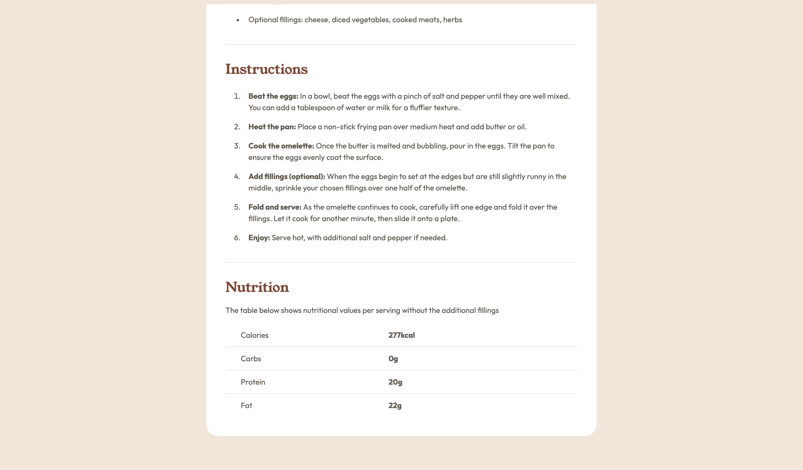

# Frontend Mentor - Recipe page solution

This is a solution to the [Recipe page challenge on Frontend Mentor](https://www.frontendmentor.io/challenges/recipe-page-KiTsR8QQKm). Frontend Mentor challenges help you improve your coding skills by building realistic projects.

## Table of contents

- [Overview](#overview)
  - [The challenge](#the-challenge)
  - [Screenshot](#screenshot)
  - [Links](#links)
- [My process](#my-process)
  - [Built with](#built-with)
  - [What I learned](#what-i-learned)
- [Author](#author)

## Overview

A simple recipe card component

### Screenshot

### Links

- Live Site URL: [View Project](https://carson-haskell.github.io/recipe-card/)

## My process

Referring to the Figma designs, I begin by creating a simple skeleton of the page with semantic HTML. Then, I create all the CSS variables to match Figma's design system, so that I am applying consistent styling. Finally, I begin styling in the following sequence: big (outer-most element) to small (inward-most element), top to bottom. By that, I mean I start with the outermost-element (the body), and then move inward (the card --> card content --> so forth), moving top to bottom. So once I begin working on the card, I work from the top element (the image) to the bottom (the table), working inward as I reach various sections, such as "preperation" or "ingredients." I've found this approach of styling, working from the "big picture" to the smaller details, to be most effective. Once you have everything generally in place (the card, the structure of the card content) it's much easier to work on the smaller stuff (like the spacing of sections within the card content).

### Built with

- Semantic HTML5 markup
- CSS custom properties
- CSS media queries
- Flexbox

### What I learned

How to utilize semantic HTML instead of just throwing divs all over the place. Also, how to create and effectively style tables. I don't use tables very often, so I spent probably the most time thinking about the best way to markup/style the nutrition section.
Also, I learned that I rely on flexbox too much, and I probably use it more than I need. When I first started styling, I realized I was using flexbox all over the place, and I wondered if perhaps I even needed to. So, after some testing and tweaking, I pretty much didn't even need flexbox at all, and I realized I had been using it way too much!

## Author

- Website - [Carson Haskell](https://portfolio-website-sandy-alpha-78.vercel.app/)
- Frontend Mentor - [@carson-haskell](https://www.frontendmentor.io/profile/carson-haskell)
